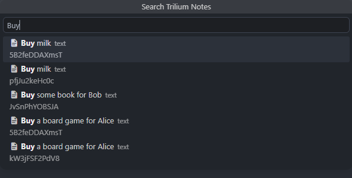
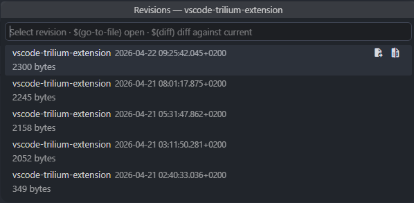

# Trilium Notes for VS Code

Browse, search, and edit your [Trilium Notes](https://github.com/TriliumNext/trilium-notes) directly inside VS Code using the [ETAPI REST API](https://triliumnotes.org/api).

---

## Welcome

This extension is built for people who already live in VS Code and want their Trilium Notes workflow in the same place.

Use it to:

- Browse your full Trilium note tree in the sidebar.
- Edit text notes in a rich CKEditor-powered WYSIWYG editor.
- Open code, mermaid, canvas, and other note types with the right editor flow.
- Search notes quickly, manage attributes and attachments, and review revisions.
- Clone, move, and export notes without leaving VS Code.

If you want a fast setup, you can be connected in about a minute.

## Quick Start

1. Install the extension.
2. Open the **Trilium Notes** view in the Activity Bar.
3. Run **Trilium: Connect to Trilium Server**.
4. Enter your server URL and ETAPI token.
5. Open a note and start editing.

## Why It Feels Native

- Keyboard-first workflows using normal VS Code commands and save behavior.
- Theme-aware editor styling so notes blend with your current color theme.
- Secure token storage through VS Code secret storage.
- Deep command coverage for daily note management.

## Read Next

- New here: start with [Getting Started](docs/getting-started.md)
- Want capabilities overview: [Features](docs/features.md)
- Looking for commands and settings: [Reference](docs/reference.md)
- Using Copilot or scripts: [Automation](docs/automation.md)
- Curious what is planned: [Roadmap](docs/roadmap.md)
- Attribution and license details: [Credits](docs/credits.md)

## Documentation

- [Getting Started](docs/getting-started.md)
- [Features](docs/features.md)
- [Reference](docs/reference.md)
- [Automation](docs/automation.md)
- [Roadmap](docs/roadmap.md)
- [Credits](docs/credits.md)

## Screenshot Gallery

<!-- markdownlint-disable MD033 -->
<table>
  <tr>
    <td align="center" valign="bottom" style="border: none;">
       
      <strong>Note tree:</strong> Browse notes with type icons and visual cues.
    </td>
    <td align="center" valign="bottom" style="border: none;">
       
      <strong>WYSIWYG editor:</strong> Edit Trilium text notes with rich formatting.
    </td>
  </tr>
  <tr>
    <td align="center" valign="bottom" style="border: none;">
       
      <strong>Attributes sidebar:</strong> Edit labels, relations, and attachments inline.
    </td>
    <td align="center" valign="bottom" style="border: none;">
       
      <strong>Search:</strong> Jump to notes quickly with live results.
    </td>
  </tr>
  <tr>
    <td align="center" valign="bottom" style="border: none;">
       
      <strong>Revisions and diff:</strong> Open previous revisions and compare changes safely.
    </td>
    <td align="center" valign="bottom" style="border: none;"></td>
  </tr>
</table>
<!-- markdownlint-enable MD033 -->

## Requirements

- VS Code 1.116 or later
- Desktop VS Code (not web/Codespaces)
- A reachable Trilium Notes server with ETAPI enabled

## Community and Feedback

Issues, bug reports, and feature ideas are welcome in this repository. If something feels clunky in daily use, open an issue and describe your workflow.

## License

GNU Affero General Public License v3.0 or later. See [LICENSE](LICENSE).
