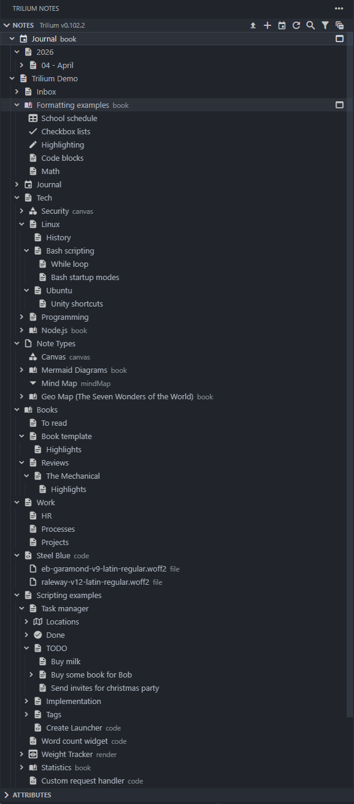
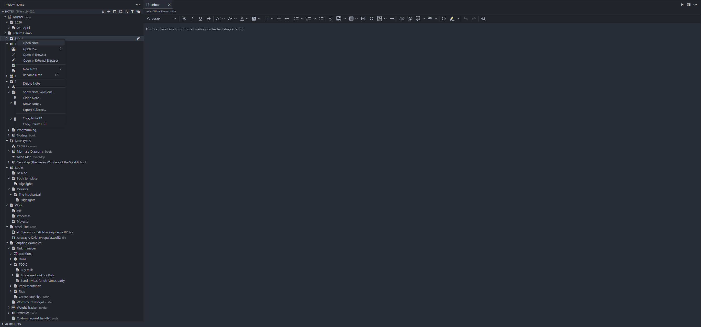
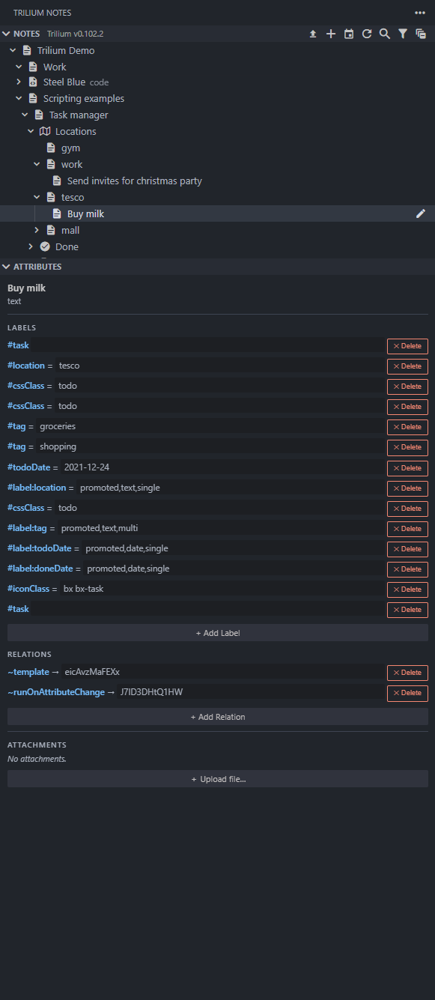

# Features

## Screenshots

## Note Tree

- Browse your entire Trilium note hierarchy in the VS Code Activity Bar sidebar.
- Notes with children can be expanded; leaf notes open on single click.
- Note type is shown as a description badge, for example `code`, `mermaid`, or `canvas`.
- Note icons are resolved from the `#iconClass` label attribute. Each note type has a sensible default icon when no attribute is set.
- Note colors are driven by the `#color` label attribute and shown as tree item color decorations.

## Open and Edit Notes

- **Text notes** open in a full **CKEditor 5 WYSIWYG** editor embedded in a VS Code webview. The editor operates directly on Trilium's native HTML with native VS Code undo/redo and `Ctrl+S` save support.
- The editor includes headings, inline formatting, lists, tables, inline code, code blocks, math, Mermaid diagrams, admonitions, footnotes, keyboard markers, find and replace, and full formatting controls.
- **Code notes** open with the correct language where possible, and changes save directly back to Trilium.
- **Mermaid notes** open as `.mmd` files and can be rendered visually with Mermaid preview extensions.
- **Canvas notes** open as `.excalidraw` JSON and can be rendered visually with the Excalidraw VS Code extension.
- **Mind Map notes** are currently converted to a Markdown heading hierarchy, then converted back to MindElixir JSON on save.

A breadcrumb bar above the CKEditor content area shows the full parent path of the open note and updates automatically when the note loads.

## Save Safety and Conflict Resolution

- Text-note saves use a server-first flow: on `Ctrl+S`, the extension attempts to sync to Trilium before clearing local dirty state.
- If upstream content changed, the editor shows a conflict dialog with three options:
  - **Compare** opens a side-by-side diff.
  - **Keep Ours** keeps your local content and pushes it on save.
  - **Use Theirs** replaces local content with the server version.
- The diff view is practical for merging:
  - **Theirs** (left) is read-only.
  - **Ours** (right) is your actual editable document.
- Both sides are HTML-formatted for readable line-by-line comparison.
- If a conflict remains unresolved, the tab stays dirty so VS Code still warns on close.

## Theme Integration

The CKEditor webview follows the active VS Code theme automatically. Editor colors are mapped from VS Code CSS variables to CKEditor variables at runtime.

## Open as Fallback Formats

Right-click any **text** note and choose **Open as...** for alternative views:

- **Open as Markdown** converts the note's HTML to Markdown, opens it in VS Code's text editor, and converts it back to HTML on save.
- **Open as HTML** opens the raw CKEditor HTML without conversion in a read-only view.

## Open in Browser

Right-click any note and choose one of the browser actions:

- **Open in Browser** opens the note in VS Code's built-in Simple Browser and falls back to the system browser if needed.
- **Open in External Browser** opens the note directly in your default browser with the full Trilium note path.

## File and Image Notes

Right-click a **file** or **image** note and choose **Download File** to save the binary content locally.

## Create Notes

- Click the **+** button in the panel toolbar to create a new text note under the root.
- Click **Import Notes** in the toolbar to bulk-import a JSON tree.
- Right-click any note and choose **New Note...** to create one of the supported note types.
- Right-click empty space in the panel to create a new note at the root level.

## Rename and Delete

- Right-click any note and choose **Rename Note**, or press **F2** while the tree has focus.
- Right-click any note and choose **Delete Note**. A confirmation dialog is shown, and any open editor tab for that note is closed automatically.

## Journal and Calendar Notes

- Use **Trilium: Open Today's Journal Note** to open today's journal entry.
- Use **Trilium: Open Calendar Note...** to open today's, inbox, this week's, this month's, or this year's note.

## Attributes and Attachments Sidebar

Select any note in the tree to see its **labels**, **relations**, and **attachments** in the **Attributes** panel below the note tree.

- Label values are editable inline. Press **Enter** or blur to save, and **Escape** to cancel.
- Each attribute has a delete button.
- **Add Label** and **Add Relation** create new attributes.
- Attachments can be downloaded, deleted, or uploaded directly from the sidebar.

## Revision History

Right-click any note and choose **Show Note Revisions...** to see saved revisions, open them read-only, or diff them against the current note.

## Clone and Move Notes

- **Clone Note...** places the note in a second location in the tree using Trilium's linked-note model.
- **Move Note...** moves the note to a new parent. Moving is blocked if the note has only one location, because that would effectively delete it.

## Export Subtree

Right-click any note and choose **Export Subtree...** to export the note and all descendants as either:

- **HTML ZIP** for a full HTML export with embedded assets.
- **Markdown ZIP** for a plain-text Markdown export.

## Known Limitations

- **Protected notes** are not supported. Unlock them in Trilium first under **Options -> Protected Session**.
- **Canvas notes** are opened as raw JSON unless you install the Excalidraw extension.
- **Mind map notes** currently round-trip through Markdown, so MindElixir node properties such as colors, styles, and layout direction are not preserved.
- **Image upload** from the WYSIWYG toolbar requires a server-side upload handler, so image attachments should currently be added from the sidebar instead.
- ALT+click to open externally is not supported because of VS Code tree API limitations. Use the right-click **Open in External Browser** command instead.
- Desktop only. Web extensions and Codespaces are not supported.
